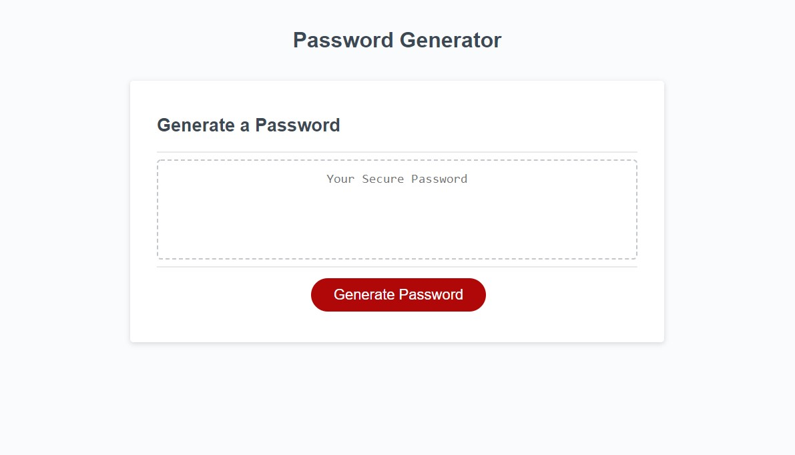

# Custom-Password-Generator

This app will generate a password according to User settings.
Specifically, the user can set the length (from 8 to 128 characters) and what characters are included.

The default password will contain lower case alphabet (en) but can be set by user choice to contain Uppercase, numbers, and/or symbols.

## Instructions

To use, click on the "Generate Password" Button.

A pop up window will show up for the following options;

    1.  Length of the password. Please entere a number in between  8 and 128 to set the desired length of password.
    2.  Does the password need Uppercase letters? Type yes or no into the input box.
    3.  Does the password require numbers? Type yes or no into the input box.
    4.  Does the password require symbols? Type yes or no into the input box. 

Once all of these have been input, the generator will create a random password according to the chosen specifciation.

